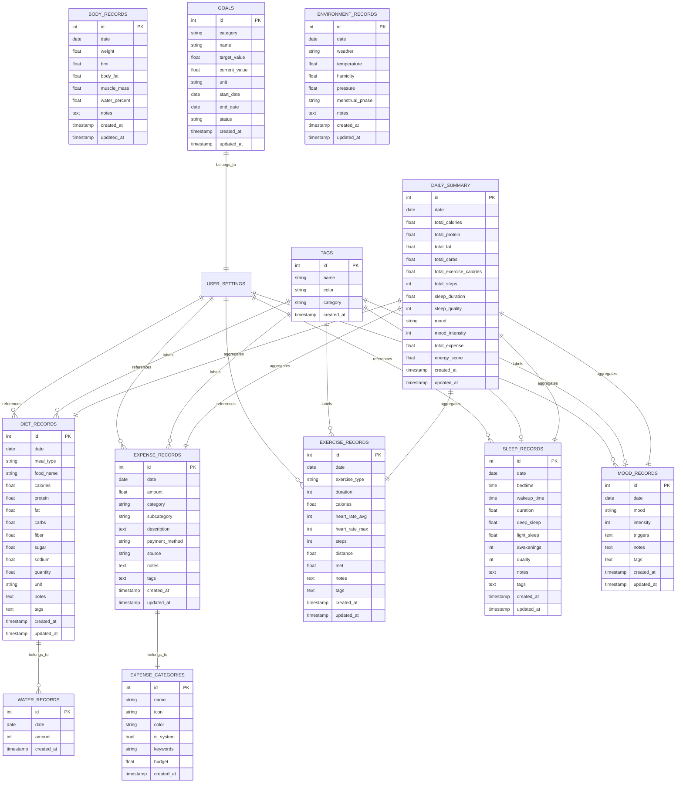

# 数据库设计文档 - 你今天活得怎么样？

## Mermaid ER 图



## SQL 建表语句

### 用户设置表
```sql
CREATE TABLE user_settings (
    id INTEGER PRIMARY KEY AUTOINCREMENT,
    key TEXT UNIQUE NOT NULL,
    value TEXT,
    updated_at TIMESTAMP DEFAULT CURRENT_TIMESTAMP
);
```

### 饮食记录表
```sql
CREATE TABLE diet_records (
    id INTEGER PRIMARY KEY AUTOINCREMENT,
    date DATE NOT NULL,
    meal_type TEXT CHECK(meal_type IN ('breakfast', 'lunch', 'dinner', 'snack')) NOT NULL,
    food_name TEXT NOT NULL,
    calories REAL DEFAULT 0,
    protein REAL DEFAULT 0,
    fat REAL DEFAULT 0,
    carbs REAL DEFAULT 0,
    fiber REAL DEFAULT 0,
    sugar REAL DEFAULT 0,
    sodium REAL DEFAULT 0,
    quantity REAL DEFAULT 1,
    unit TEXT DEFAULT '份',
    notes TEXT,
    tags TEXT,
    created_at TIMESTAMP DEFAULT CURRENT_TIMESTAMP,
    updated_at TIMESTAMP DEFAULT CURRENT_TIMESTAMP
);
```

### 饮水记录表
```sql
CREATE TABLE water_records (
    id INTEGER PRIMARY KEY AUTOINCREMENT,
    date DATE NOT NULL,
    amount INTEGER NOT NULL,
    created_at TIMESTAMP DEFAULT CURRENT_TIMESTAMP
);
```

### 消费记录表
```sql
CREATE TABLE expense_records (
    id INTEGER PRIMARY KEY AUTOINCREMENT,
    date DATE NOT NULL,
    amount REAL NOT NULL,
    category TEXT NOT NULL,
    subcategory TEXT,
    description TEXT,
    payment_method TEXT,
    source TEXT CHECK(source IN ('manual', 'wechat', 'alipay')),
    notes TEXT,
    tags TEXT,
    created_at TIMESTAMP DEFAULT CURRENT_TIMESTAMP,
    updated_at TIMESTAMP DEFAULT CURRENT_TIMESTAMP
);
```

### 消费分类表
```sql
CREATE TABLE expense_categories (
    id INTEGER PRIMARY KEY AUTOINCREMENT,
    name TEXT UNIQUE NOT NULL,
    icon TEXT,
    color TEXT,
    is_system INTEGER DEFAULT 0,
    keywords TEXT,
    budget REAL,
    created_at TIMESTAMP DEFAULT CURRENT_TIMESTAMP
);
```

### 运动记录表
```sql
CREATE TABLE exercise_records (
    id INTEGER PRIMARY KEY AUTOINCREMENT,
    date DATE NOT NULL,
    exercise_type TEXT NOT NULL,
    duration INTEGER NOT NULL,
    calories REAL DEFAULT 0,
    heart_rate_avg INTEGER,
    heart_rate_max INTEGER,
    steps INTEGER DEFAULT 0,
    distance REAL,
    met REAL DEFAULT 3.5,
    notes TEXT,
    tags TEXT,
    created_at TIMESTAMP DEFAULT CURRENT_TIMESTAMP,
    updated_at TIMESTAMP DEFAULT CURRENT_TIMESTAMP
);
```

### 睡眠记录表
```sql
CREATE TABLE sleep_records (
    id INTEGER PRIMARY KEY AUTOINCREMENT,
    date DATE NOT NULL,
    bedtime TIME NOT NULL,
    wakeup_time TIME NOT NULL,
    duration REAL NOT NULL,
    deep_sleep REAL,
    light_sleep REAL,
    awakenings INTEGER DEFAULT 0,
    quality INTEGER CHECK(quality >= 1 AND quality <= 5),
    notes TEXT,
    tags TEXT,
    created_at TIMESTAMP DEFAULT CURRENT_TIMESTAMP,
    updated_at TIMESTAMP DEFAULT CURRENT_TIMESTAMP
);
```

### 情绪记录表
```sql
CREATE TABLE mood_records (
    id INTEGER PRIMARY KEY AUTOINCREMENT,
    date DATE NOT NULL,
    mood TEXT NOT NULL,
    intensity INTEGER CHECK(intensity >= 1 AND intensity <= 5),
    triggers TEXT,
    notes TEXT,
    tags TEXT,
    created_at TIMESTAMP DEFAULT CURRENT_TIMESTAMP,
    updated_at TIMESTAMP DEFAULT CURRENT_TIMESTAMP
);
```

### 体重体脂记录表
```sql
CREATE TABLE body_records (
    id INTEGER PRIMARY KEY AUTOINCREMENT,
    date DATE UNIQUE NOT NULL,
    weight REAL,
    bmi REAL,
    body_fat REAL,
    muscle_mass REAL,
    water_percent REAL,
    notes TEXT,
    created_at TIMESTAMP DEFAULT CURRENT_TIMESTAMP,
    updated_at TIMESTAMP DEFAULT CURRENT_TIMESTAMP
);
```

### 目标设定表
```sql
CREATE TABLE goals (
    id INTEGER PRIMARY KEY AUTOINCREMENT,
    category TEXT NOT NULL,
    name TEXT NOT NULL,
    target_value REAL NOT NULL,
    current_value REAL DEFAULT 0,
    unit TEXT,
    start_date DATE,
    end_date DATE,
    status TEXT CHECK(status IN ('active', 'completed', 'abandoned')) DEFAULT 'active',
    created_at TIMESTAMP DEFAULT CURRENT_TIMESTAMP,
    updated_at TIMESTAMP DEFAULT CURRENT_TIMESTAMP
);
```

### 全局标签表
```sql
CREATE TABLE tags (
    id INTEGER PRIMARY KEY AUTOINCREMENT,
    name TEXT UNIQUE NOT NULL,
    color TEXT,
    category TEXT,
    created_at TIMESTAMP DEFAULT CURRENT_TIMESTAMP
);
```

### 环境因素记录表
```sql
CREATE TABLE environment_records (
    id INTEGER PRIMARY KEY AUTOINCREMENT,
    date DATE UNIQUE NOT NULL,
    weather TEXT,
    temperature REAL,
    humidity REAL,
    pressure REAL,
    menstrual_phase TEXT,
    notes TEXT,
    created_at TIMESTAMP DEFAULT CURRENT_TIMESTAMP,
    updated_at TIMESTAMP DEFAULT CURRENT_TIMESTAMP
);
```

### 每日汇总表
```sql
CREATE TABLE daily_summary (
    id INTEGER PRIMARY KEY AUTOINCREMENT,
    date DATE UNIQUE NOT NULL,
    total_calories REAL DEFAULT 0,
    total_protein REAL DEFAULT 0,
    total_fat REAL DEFAULT 0,
    total_carbs REAL DEFAULT 0,
    total_exercise_calories REAL DEFAULT 0,
    total_steps INTEGER DEFAULT 0,
    sleep_duration REAL,
    sleep_quality INTEGER,
    mood TEXT,
    mood_intensity INTEGER,
    total_expense REAL DEFAULT 0,
    energy_score REAL,
    created_at TIMESTAMP DEFAULT CURRENT_TIMESTAMP,
    updated_at TIMESTAMP DEFAULT CURRENT_TIMESTAMP
);
```

## 索引设计

为提升查询性能，创建以下索引：

```sql
CREATE INDEX idx_diet_date ON diet_records(date);
CREATE INDEX idx_expense_date ON expense_records(date);
CREATE INDEX idx_exercise_date ON exercise_records(date);
CREATE INDEX idx_sleep_date ON sleep_records(date);
CREATE INDEX idx_mood_date ON mood_records(date);
CREATE INDEX idx_water_date ON water_records(date);
CREATE INDEX idx_body_date ON body_records(date);
```

## 表关系说明

1. **饮食记录 (diet_records)**: 核心营养数据表，记录每餐摄入
2. **饮水记录 (water_records)**: 独立追踪饮水量
3. **消费记录 (expense_records)**: 关联消费分类表
4. **运动记录 (exercise_records)**: 包含多种运动类型
5. **睡眠记录 (sleep_records)**: 深睡/浅睡分析
6. **情绪记录 (mood_records)**: 情绪追踪与分析
7. **体重体脂 (body_records)**: 身体成分变化
8. **目标设定 (goals)**: 各模块目标追踪
9. **全局标签 (tags)**: 跨模块标签系统
10. **环境因素 (environment_records)**: 天气等外部因素
11. **每日汇总 (daily_summary)**: 预计算汇总数据，加速仪表盘查询
